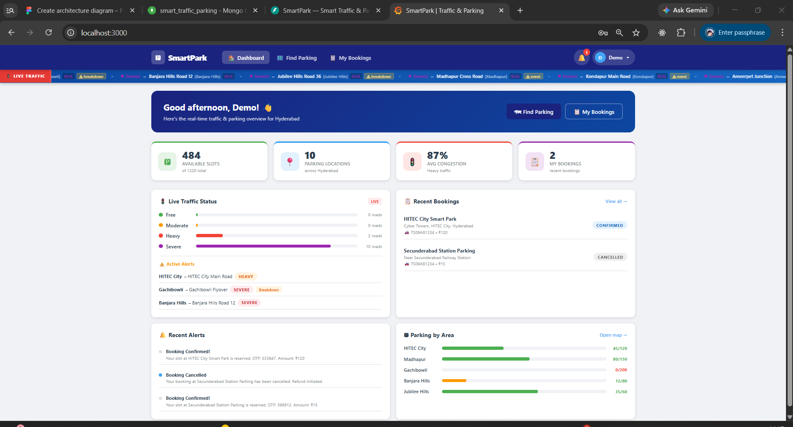
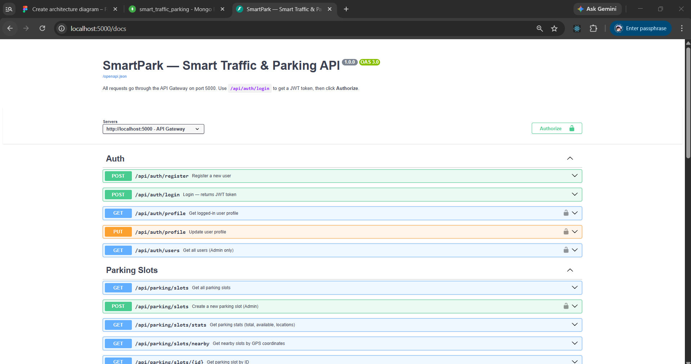
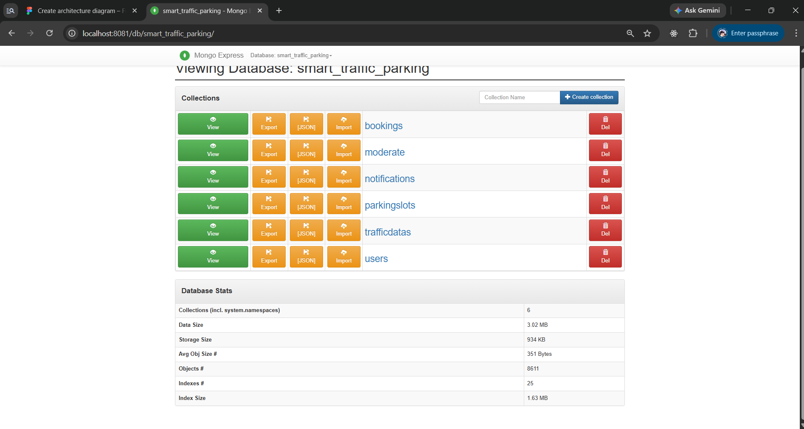
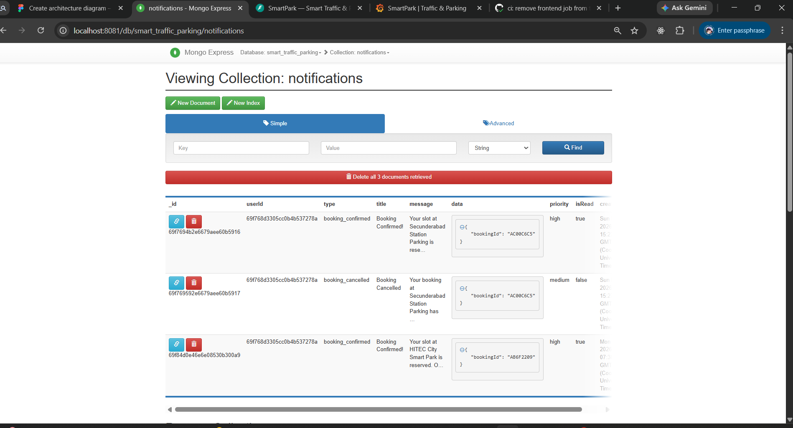
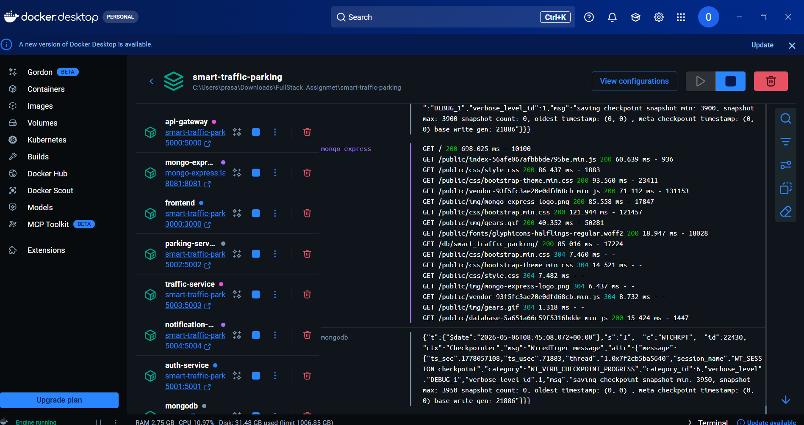
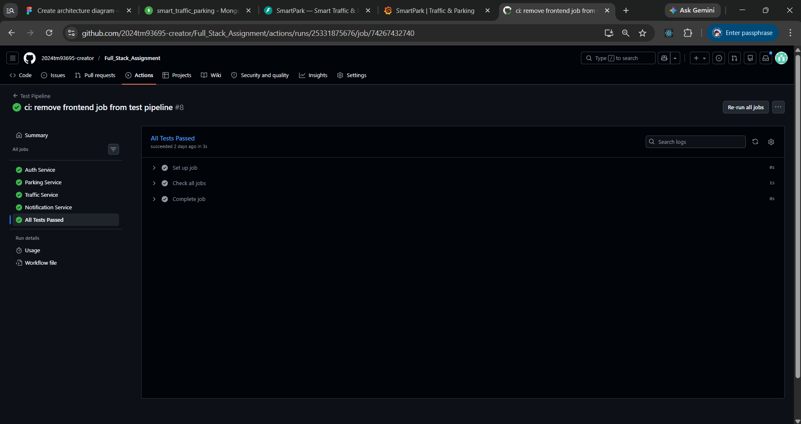

# Smart Traffic Parking System

A full-stack microservices application for real-time smart parking and traffic management. Built with Node.js, React, MongoDB, and Docker.

---

## Architecture

```
                        ┌─────────────────┐
                        │    Frontend      │
                        │  React (: 3000)  │
                        └────────┬────────┘
                                 │
                        ┌────────▼────────┐
                        │   API Gateway   │
                        │  Express (:5000) │
                        │  JWT · Rate Limit│
                        └──┬──┬──┬──┬────┘
                           │  │  │  │
          ┌────────────────┘  │  │  └──────────────────┐
          │              ┌────┘  └────┐                 │
          ▼              ▼            ▼                  ▼
   ┌─────────────┐ ┌──────────┐ ┌─────────┐ ┌──────────────────┐
   │ Auth Service│ │ Parking  │ │ Traffic │ │  Notification    │
   │   (:5001)   │ │ Service  │ │ Service │ │    Service       │
   │             │ │ (:5002)  │ │ (:5003) │ │    (:5004)       │
   └──────┬──────┘ └────┬─────┘ └────┬────┘ └────────┬─────────┘
          │              │            │                 │
          └──────────────┴────────────┴─────────────────┘
                                     │
                            ┌────────▼────────┐
                            │    MongoDB       │
                            │    (:27017)      │
                            └─────────────────┘
```

---

## Features

- **Authentication** — JWT-based register/login, role-based access (user/admin)
- **Parking Management** — Real-time slot availability, geolocation-based nearby search, bookings with QR codes, check-in/check-out
- **Traffic Monitoring** — Live traffic data streaming via WebSocket, heatmaps, ETA calculations, IoT simulator
- **Notifications** — Real-time push notifications via Socket.io with per-user rooms
- **Admin Dashboard** — Occupancy stats, booking analytics, charts (Recharts)
- **Interactive Map** — Leaflet map with parking slot overlays and traffic data

---

## Tech Stack

| Layer | Technology |
|---|---|
| Frontend | React 18, React Router v6, Leaflet, Socket.io-client, Recharts |
| API Gateway | Node.js, Express, http-proxy-middleware, express-rate-limit |
| Backend Services | Node.js, Express, Mongoose, Socket.io, JWT, bcryptjs |
| Database | MongoDB 7 |
| Infrastructure | Docker, Docker Compose |

---

## Prerequisites

- [Docker](https://www.docker.com/) & Docker Compose **or** Node.js 18+ and MongoDB 7

---

## Quick Start (Docker)

```bash
# Clone the repository
git clone <repo-url>
cd smart-traffic-parking

# Copy environment file
cp .env.example .env

# Build and start all services
docker compose up --build
```

| Service | URL |
|---|---|
| Frontend | http://localhost:3000 |
| API Gateway | http://localhost:5000 |
| API Docs (Swagger) | http://localhost:5000/api-docs |
| Mongo Express (DB UI) | http://localhost:8081 |

Mongo Express credentials: `admin` / `admin123`

---

## Manual Setup (without Docker)

Requires MongoDB running locally on port 27017.

```bash
cp .env.example .env
```

Start each service in a separate terminal:

```bash
# Auth Service
cd services/auth-service && npm install && npm start

# Parking Service
cd services/parking-service && npm install && npm start

# Traffic Service
cd services/traffic-service && npm install && npm start

# Notification Service
cd services/notification-service && npm install && npm start

# API Gateway
cd api-gateway && npm install && npm start

# Frontend
cd frontend && npm install && npm start
```

Or use the provided scripts:

```bash
# Windows
start.bat

# Linux / macOS
chmod +x start.sh && ./start.sh
```

---

## Environment Variables

Copy `.env.example` to `.env` and adjust as needed.

| Variable | Default | Description |
|---|---|---|
| `MONGO_URI` | `mongodb://localhost:27017/smart_traffic_parking` | MongoDB connection string |
| `JWT_SECRET` | `smartpark_jwt_secret_2024` | JWT signing secret |
| `AUTH_SERVICE_PORT` | `5001` | Auth service port |
| `PARKING_SERVICE_PORT` | `5002` | Parking service port |
| `TRAFFIC_SERVICE_PORT` | `5003` | Traffic service port |
| `NOTIFICATION_SERVICE_PORT` | `5004` | Notification service port |
| `REACT_APP_API_URL` | `http://localhost:5000` | Frontend → API Gateway URL |
| `REACT_APP_TRAFFIC_WS` | `http://localhost:5003` | Frontend → Traffic WebSocket URL |
| `REACT_APP_NOTIF_WS` | `http://localhost:5004` | Frontend → Notification WebSocket URL |

---

## API Reference

All requests go through the API Gateway at `http://localhost:5000`. Protected routes require `Authorization: Bearer <token>`.

### Authentication (`/api/auth`)

| Method | Endpoint | Auth | Description |
|---|---|---|---|
| POST | `/register` | No | Register a new user |
| POST | `/login` | No | Login, returns JWT |
| GET | `/profile` | Yes | Get current user profile |
| PUT | `/profile` | Yes | Update user profile |
| GET | `/users` | Admin | List all users |

### Parking (`/api/parking`)

| Method | Endpoint | Auth | Description |
|---|---|---|---|
| GET | `/slots` | No | List all parking slots |
| GET | `/slots/nearby` | No | Nearby slots by geolocation |
| GET | `/slots/stats` | No | Occupancy statistics |
| POST | `/slots` | Admin | Create a parking slot |
| PUT | `/slots/:id` | Admin | Update a parking slot |
| DELETE | `/slots/:id` | Admin | Delete a parking slot |
| POST | `/bookings` | Yes | Create a booking |
| GET | `/bookings` | Yes | Get user's bookings |
| PUT | `/bookings/:id/cancel` | Yes | Cancel a booking |
| POST | `/bookings/:id/checkin` | Yes | Check in to a booking |
| POST | `/bookings/:id/checkout` | Yes | Check out from a booking |
| GET | `/bookings/stats` | Admin | Booking statistics |

### Traffic (`/api/traffic`)

| Method | Endpoint | Auth | Description |
|---|---|---|---|
| GET | `/` | No | All traffic data |
| GET | `/stats` | No | Traffic statistics |
| GET | `/heatmap` | No | Traffic heatmap data |
| GET | `/eta` | No | ETA calculations |
| GET | `/nearby` | No | Nearby traffic data |

WebSocket: connect to `http://localhost:5003` for live traffic stream.

### Notifications (`/api/notifications`)

| Method | Endpoint | Auth | Description |
|---|---|---|---|
| GET | `/` | Yes | Get user's notifications |
| POST | `/` | Yes | Create a notification |
| PUT | `/:id/read` | Yes | Mark notification as read |
| PUT | `/read-all` | Yes | Mark all notifications as read |
| DELETE | `/:id` | Yes | Delete a notification |

WebSocket: connect to `http://localhost:5004`, join room `user:{userId}` for real-time delivery.

### Health Check

```
GET http://localhost:5000/health
```

Returns the status and URLs of all downstream services.

---

## Screenshots

### Application Dashboard

> Live dashboard showing available slot count, active bookings, average congestion, live traffic status by road, recent bookings, recent alerts, and parking occupancy by area.

### Swagger API Documentation

> Interactive OpenAPI docs at `http://localhost:5000/docs` — all Auth, Parking Slots, Bookings, Traffic, and Notification endpoints with JWT bearer authorization.

### MongoDB — Database Collections

> Mongo Express at `http://localhost:8081` showing the `smart_traffic_parking` database with all 6 collections: `bookings`, `notifications`, `parkingslots`, `trafficdatas`, `users`, and `moderate`.

### MongoDB — Notifications Collection

> Sample documents in the `notifications` collection showing `booking_confirmed` and `booking_cancelled` events delivered to users via Socket.io.

### Docker — All Services Running

> Docker Desktop showing all containers running: `api-gateway`, `mongo-express`, `frontend`, `parking-service`, `notification-service`, `auth-service`, and `mongodb`.

### CI — GitHub Actions Test Pipeline

> GitHub Actions test pipeline run #8 — all four service jobs (Auth, Parking, Traffic, Notification) passed successfully.

---

## Project Structure

```
smart-traffic-parking/
├── api-gateway/              # Express reverse proxy + JWT guard
├── services/
│   ├── auth-service/         # User registration, login, JWT
│   ├── parking-service/      # Slots, bookings, geolocation
│   ├── traffic-service/      # Live traffic data, WebSocket, IoT sim
│   └── notification-service/ # Real-time notifications, WebSocket
├── frontend/                 # React SPA
├── docker-compose.yml
├── .env.example
├── start.bat                 # Windows startup script
└── start.sh                  # Linux/macOS startup script
```

---

## Frontend-Backend Communication

This section demonstrates exactly how the React frontend talks to the backend microservices through the API Gateway, covering REST/HTTP calls, JWT authentication, and real-time WebSocket streams.

---

### Communication Architecture

```
┌──────────────────────────────────────────────────────────────┐
│                     React Frontend (:3000)                    │
│                                                              │
│  ┌──────────────┐   ┌────────────────┐   ┌───────────────┐  │
│  │ AuthContext  │   │   AppContext    │   │  Page / Comp  │  │
│  │ login()      │   │ traffic socket │   │  api.get()    │  │
│  │ register()   │   │ notif  socket  │   │  api.post()   │  │
│  └──────┬───────┘   └───────┬────────┘   └──────┬────────┘  │
│         │  Axios (HTTP)     │ Socket.io          │ Axios     │
└─────────┼───────────────────┼────────────────────┼──────────┘
          │                   │ WebSocket          │ HTTP REST
          ▼                   ▼                    ▼
┌─────────────────────────────────────────────────────────────┐
│                  API Gateway  (:5000)                        │
│   CORS · JWT guard (verifyToken) · Rate-limit (300/15 min)  │
└──┬────────────┬────────────┬─────────────┬──────────────────┘
   │            │            │             │  HTTP Proxy
   ▼            ▼            ▼             ▼
:5001        :5002        :5003         :5004
Auth      Parking      Traffic      Notification
Service   Service      Service       Service
   │            │         │  WS          │  WS
   └────────────┴────┬────┘             │
                     ▼                  │
                  MongoDB           Socket.io
                  (:27017)         rooms per user
```

There are two communication channels:

| Channel | Library | Used for |
|---|---|---|
| **HTTP REST** | `axios` | CRUD operations, auth, bookings |
| **WebSocket** | `socket.io-client` | Live traffic updates, push notifications |

---

### 1. Axios Instance — `frontend/src/services/api.js`

A single axios instance is created once and shared across the entire app.

```js
// frontend/src/services/api.js
import axios from 'axios';

const api = axios.create({
  baseURL: process.env.REACT_APP_API_URL || 'http://localhost:5000',
  headers: { 'Content-Type': 'application/json' }
});

// Restore auth header from localStorage on page load
const storedToken = localStorage.getItem('token');
if (storedToken) {
  api.defaults.headers.common['Authorization'] = `Bearer ${storedToken}`;
}

// Global 401 handler — clears session and redirects to login
api.interceptors.response.use(
  (res) => res,
  (err) => {
    if (err.response?.status === 401) {
      localStorage.removeItem('token');
      localStorage.removeItem('user');
      window.location.href = '/login';
    }
    return Promise.reject(err);
  }
);

export default api;
```

Every page and context imports this `api` object and calls `api.get(...)`, `api.post(...)`, etc. All requests are automatically sent to `http://localhost:5000` (the API Gateway) with the JWT bearer token attached.

---

### 2. API Gateway — Route Proxying & JWT Guard

The API Gateway receives every request from the frontend and proxies it to the correct microservice. Protected routes are blocked unless a valid JWT is present.

```js
// api-gateway/server.js (key excerpt)

const verifyToken = (req, res, next) => {
  const auth = req.headers.authorization;          // "Bearer <token>"
  if (!auth || !auth.startsWith('Bearer '))
    return res.status(401).json({ error: 'Access denied.' });

  try {
    const decoded = jwt.verify(auth.substring(7), process.env.JWT_SECRET);
    req.headers['x-user-id']   = decoded.id;       // forwarded to microservice
    req.headers['x-user-role'] = decoded.role;
    next();
  } catch {
    res.status(401).json({ error: 'Invalid or expired token.' });
  }
};

// Public routes — no token required
app.use('/api/auth',     createProxyMiddleware({ target: AUTH_SERVICE,    changeOrigin: true }));
app.use('/api/traffic',  createProxyMiddleware({ target: TRAFFIC_SERVICE, changeOrigin: true }));

// Mixed — GET is public, POST/PUT/DELETE require a token
app.use('/api/parking/slots', (req, res, next) => {
  if (req.method === 'GET') return next();
  verifyToken(req, res, next);
}, createProxyMiddleware({ target: PARKING_SERVICE, changeOrigin: true }));

// Always protected
app.use('/api/parking/bookings', verifyToken, createProxyMiddleware({ target: PARKING_SERVICE, changeOrigin: true }));
app.use('/api/notifications',    verifyToken, createProxyMiddleware({ target: NOTIF_SERVICE,   changeOrigin: true }));
```

When the token is valid the gateway forwards the decoded `x-user-id` and `x-user-role` headers to the downstream service so each microservice knows which user made the request without re-verifying the JWT.

---

### 3. End-to-End Example — Login Flow

**Step 1 — User submits the form** (`LoginPage.js`):

```js
// frontend/src/pages/LoginPage.js
const handleSubmit = async (e) => {
  e.preventDefault();
  try {
    const user = await login(form.email, form.password);   // calls AuthContext
    navigate(user.role === 'admin' ? '/admin' : '/');
  } catch (err) {
    setError(err.response?.data?.error || 'Login failed.');
  }
};
```

**Step 2 — AuthContext makes the API call** (`AuthContext.js`):

```js
// frontend/src/context/AuthContext.js
const login = async (email, password) => {
  // POST http://localhost:5000/api/auth/login
  const res = await api.post('/api/auth/login', { email, password });
  const { token, user: u } = res.data;

  // Persist token + attach to every future request
  localStorage.setItem('token', token);
  api.defaults.headers.common['Authorization'] = `Bearer ${token}`;
  api.defaults.headers.common['x-user-id']     = u.id;
  setUser(u);
  return u;
};
```

**Step 3 — API Gateway proxies to Auth Service** (port 5001):

```
POST /api/auth/login  →  (proxy)  →  http://localhost:5001/api/auth/login
```

No JWT check here — login is a public route.

**Step 4 — Auth Service responds**:

```json
HTTP 200 OK
{
  "token": "eyJhbGciOiJIUzI1NiIsInR5cCI6IkpXVCJ9...",
  "user": { "id": "abc123", "name": "Alice", "email": "alice@example.com", "role": "user" }
}
```

**Step 5 — On next page load**, `AuthContext` re-validates the stored token:

```js
useEffect(() => {
  const token = localStorage.getItem('token');
  if (token) {
    api.get('/api/auth/profile')   // GET http://localhost:5000/api/auth/profile
      .then(res => setUser(res.data))
      .catch(() => logout());
  }
}, []);
```

---

### 4. End-to-End Example — Fetching and Cancelling a Booking

```js
// frontend/src/pages/MyBookings.js

// Fetch all bookings for the logged-in user
const fetchBookings = async () => {
  const params = filter !== 'all' ? `?status=${filter}` : '';
  // GET http://localhost:5000/api/parking/bookings?status=confirmed
  // Gateway adds x-user-id from the JWT so the service filters by owner
  const res = await api.get(`/api/parking/bookings${params}`);
  setBookings(res.data.bookings || []);
};

// Cancel a booking
const handleCancel = async (id) => {
  // PUT http://localhost:5000/api/parking/bookings/:id/cancel
  await api.put(`/api/parking/bookings/${id}/cancel`);
  fetchBookings();   // refresh list
};

// OTP-based check-in
const handleCheckIn = async (bookingId) => {
  // POST http://localhost:5000/api/parking/bookings/:id/checkin  { otp }
  await api.post(`/api/parking/bookings/${bookingId}/checkin`, { otp });
};
```

The requests arrive at the Gateway, pass `verifyToken` (the JWT must be present), and are proxied to the Parking Service at port 5002 with `x-user-id` injected into the headers.

---

### 5. Real-Time Communication — WebSocket

Two persistent WebSocket connections are opened when the user logs in, managed in `AppContext`.

#### Traffic updates (Socket.io → Traffic Service :5003)

```js
// frontend/src/context/AppContext.js

const TRAFFIC_URL = process.env.REACT_APP_TRAFFIC_WS || 'http://localhost:5003';

useEffect(() => {
  if (!user) return;

  const sock = io(TRAFFIC_URL, { transports: ['websocket', 'polling'] });

  // Listen for live traffic data pushed by the IoT simulator
  sock.on('traffic:update', (data) => {
    setTrafficData(prev => {
      const filtered = prev.filter(t => t.roadName !== data.roadName);
      return [...filtered, data].slice(-50);   // keep last 50 road segments
    });
  });

  // Also do an initial HTTP fetch to populate data before the first event
  api.get('/api/traffic').then(r => setTrafficData(r.data)).catch(() => {});

  return () => sock.disconnect();   // clean up on logout
}, [user]);
```

#### Notifications (Socket.io → Notification Service :5004)

```js
const NOTIF_URL = process.env.REACT_APP_NOTIF_WS || 'http://localhost:5004';

useEffect(() => {
  if (!user) return;

  const sock = io(NOTIF_URL, { transports: ['websocket', 'polling'] });

  // Join a private room scoped to this user
  sock.emit('join', user.id);        // server room: "user:{userId}"

  // Handle incoming push notification
  sock.on('notification:new', (n) => {
    setNotifications(prev => [n, ...prev]);
    setUnreadCount(c => c + 1);
    addToast(n.title, n.message, n.type === 'congestion_alert' ? 'warning' : 'success');
  });

  // Initial HTTP load of existing notifications
  api.get('/api/notifications').then(r => {
    setNotifications(r.data.notifications || []);
    setUnreadCount(r.data.unreadCount || 0);
  }).catch(() => {});

  return () => sock.disconnect();
}, [user]);
```

The WebSocket connections bypass the API Gateway entirely (they connect directly to the service ports). The HTTP REST calls for reading and marking notifications still go through the Gateway and require the JWT.

---

### 6. Request / Response Summary

| Action | Method | URL (via Gateway) | Auth | Proxied to |
|---|---|---|---|---|
| Register | POST | `/api/auth/register` | No | Auth :5001 |
| Login | POST | `/api/auth/login` | No | Auth :5001 |
| Get profile | GET | `/api/auth/profile` | JWT | Auth :5001 |
| List slots | GET | `/api/parking/slots` | No | Parking :5002 |
| Create booking | POST | `/api/parking/bookings` | JWT | Parking :5002 |
| Cancel booking | PUT | `/api/parking/bookings/:id/cancel` | JWT | Parking :5002 |
| Check in | POST | `/api/parking/bookings/:id/checkin` | JWT | Parking :5002 |
| Traffic data | GET | `/api/traffic` | No | Traffic :5003 |
| Live traffic | WS | `ws://localhost:5003` | — | Direct to :5003 |
| Notifications | GET | `/api/notifications` | JWT | Notif :5004 |
| Mark read | PUT | `/api/notifications/:id/read` | JWT | Notif :5004 |
| Push notifs | WS | `ws://localhost:5004` | — | Direct to :5004 |

---

## License

MIT
